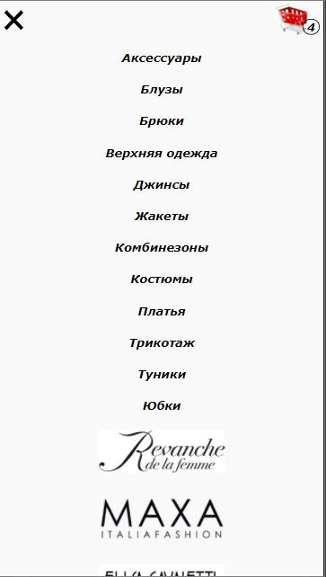
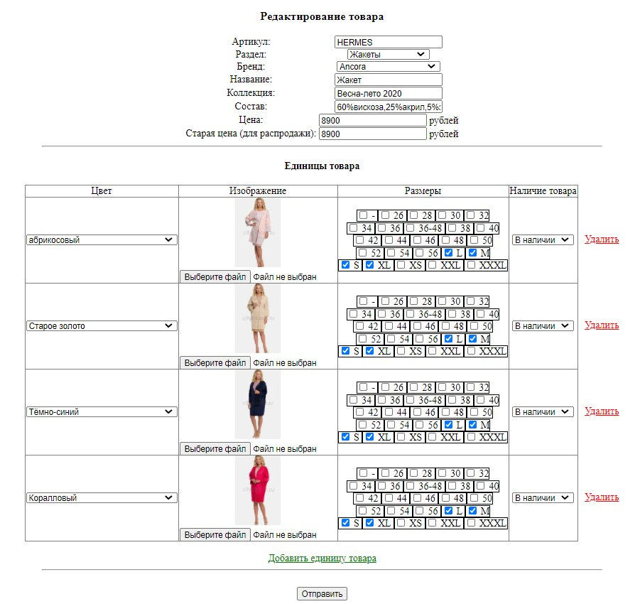

# Интернет-магазин женской одежды
Интернет-магазин на PHP без использования фреймворков. Адаптивный дизайн. Собственный движок.

## Функционал сайта

- Разделы (блузы, платья, юбки и т.д.)
- Бренды
- Корзина
- Форма оформления заказа
- Поиск
- Скидки

## Функционал панели администратора

- Управление товарами, разделами и брендами
- Управление заказами
- Управление купонами
- Статистика

## Технологии

- HTML, CSS и JS
- PHP и MySQL

## Структура движка

## Установка

1. Размещаем папку сайта на веб-сервере
2. В СУБД запускаем [скрипт создания бд](localhost.sql)

<i>Конифги содержит класс [Config](www/lib/config_class.php). Дефолтный логин и пароль панели администратора (доступна по пути shop.ru/admin) - Admin 123.</i>

## Скриншоты

|  | 
|:--:| 
| *Корзина* |

|  | 
|:--:| 
| *Оформление заказа* |

|  | 
|:--:| 
| *Список заказов в панели администратора* |

|  | 
|:--:| 
| *Редактирование товара в панели администратора* |